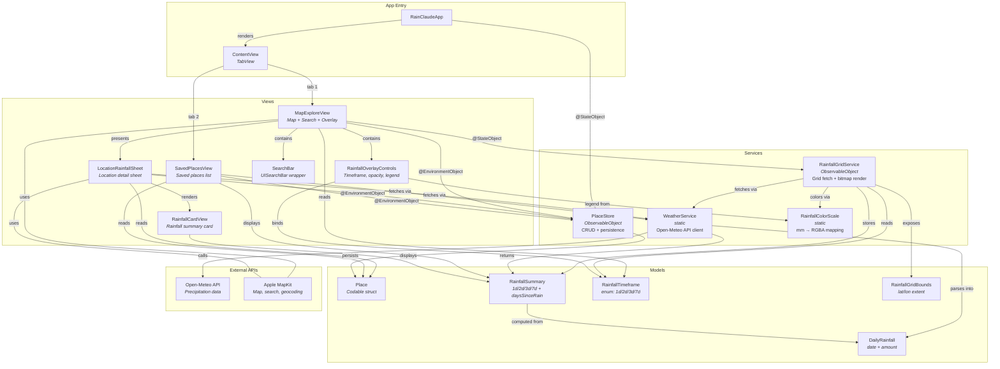

# RainClaude iOS

A native iOS app for tracking accumulated rainfall anywhere on the map. Search for outdoor places, save your favorites, and visualize precipitation with a smooth, interactive color-coded overlay.

## Features

- **Smooth rainfall overlay** -- Bitmap-rendered heatmap using per-pixel bilinear interpolation and Gaussian blur for smooth color gradients. Supports time period switching (1d/2d/3d/7d) and an opacity slider.
- **Place search** -- Search bar powered by `MKLocalSearch` with outdoor place prioritization (parks, forests, trails, campgrounds) via `MKLocalPointsOfInterestRequest`. Results are biased toward the current map viewport.
- **Click-to-inspect** -- Tap anywhere on the map to see rainfall data for that location.
- **Saved places** -- Save locations with custom names. Each saved place shows as an orange marker on the map.
- **Rainfall summary** -- For each location, see total precipitation over the last 1, 2, 3, and 7 days, plus days since last rain.

## Architecture

The app follows a layered SwiftUI architecture with four groups: **App**, **Views**, **Services**, and **Models**. State flows downward through SwiftUI's environment and `@StateObject` ownership, while data flows from the Open-Meteo API through services into view-bound models.

### Diagram

([source](docs/architecture.mmd))



### Layers

**App** -- `RainClaudeApp` is the entry point. It creates the `PlaceStore` as a `@StateObject` and injects it into the SwiftUI environment. `ContentView` is a `TabView` routing between the two main screens.

**Views** -- Six view types, split across two tabs:

| View | Role |
|------|------|
| `MapExploreView` | Primary map tab. Owns `RainfallGridService`, renders the rainfall bitmap overlay via `MapProxy` coordinate conversion, manages the search bar and overlay controls, and presents `LocationRainfallSheet` on tap. |
| `SavedPlacesView` | "Places" tab. Lists saved places with concurrently-fetched rainfall data. Supports pull-to-refresh, swipe-to-delete, and rename. |
| `LocationRainfallSheet` | Detail sheet for a tapped or selected location. Reverse-geocodes for a name, fetches rainfall, and provides save/unsave/rename actions via `PlaceStore`. |
| `RainfallCardView` | Reusable card displaying a `RainfallSummary` (four timeframe tiles + days since last rain). |
| `RainfallOverlayControls` | Floating panel with timeframe picker, opacity slider, and color legend. |
| `SearchBar` | `UIViewRepresentable` wrapping `UISearchBar` for text input and focus management. |

**Services** -- Four service types, none requiring instantiation except `PlaceStore` and `RainfallGridService`:

| Service | Role |
|---------|------|
| `RainfallGridService` | The heatmap engine. Divides the visible map region into a ~12x12 grid, fetches each cell via `WeatherService`, caches results (15-min TTL), renders an upscaled bilinearly-interpolated RGBA bitmap with Gaussian blur, and caches rendered `UIImage`s per timeframe. |
| `WeatherService` | Stateless API client (enum namespace). Single entry point `fetchRainfall(latitude:longitude:)` calls the Open-Meteo API and returns a `RainfallSummary`. Called from three sites: `RainfallGridService`, `LocationRainfallSheet`, and `SavedPlacesView`. |
| `PlaceStore` | The only shared mutable state. `ObservableObject` with a `@Published` array of `Place` objects. Provides CRUD operations and proximity search. Persists to `saved_places.json` via `JSONEncoder`. |
| `RainfallColorScale` | Pure mapping from rainfall mm to RGBA color. Defines 8 threshold stops (clear → green → yellow → orange → red → purple). Pre-computes RGBA components for efficient per-pixel bitmap rendering. |

**Models** -- Five value types with no external dependencies:

| Model | Role |
|-------|------|
| `Place` | A saved location (UUID, name, lat/lon). `Codable` for persistence. |
| `DailyRainfall` | A single day's rainfall record (date + mm amount). |
| `RainfallSummary` | Aggregated rainfall: 1/2/3/7-day totals and days since last rain. Computed from `[DailyRainfall]`. |
| `RainfallTimeframe` | Enum (1d/2d/3d/7d) used to select which summary field to display. |
| `RainfallGridBounds` | Lat/lon bounding box for positioning the overlay image on the map. |

### Key data flows

**Heatmap rendering** -- When the map camera moves, `MapExploreView` calls `RainfallGridService.updateRegion()` (debounced 500ms). The service builds a grid, fetches uncached cells via `WeatherService`, constructs a bitmap using `RainfallColorScale` for coloring with bilinear interpolation between cells, and publishes the result. The view reads the `UIImage` and positions it on the map using `MapProxy` coordinate-to-screen conversion.

**Tap-to-inspect** -- A map tap converts screen coordinates to lat/lon via `MapProxy`, then presents `LocationRainfallSheet` which independently calls `WeatherService.fetchRainfall()` and reverse-geocodes the location.

**Saved places** -- `PlaceStore` is injected via `.environmentObject` from the root. `LocationRainfallSheet` saves/removes places, `MapExploreView` reads them for map markers, and `SavedPlacesView` lists them with concurrently-fetched rainfall data.

## Building

```bash
xcodebuild -scheme RainClaude -destination 'platform=iOS Simulator,name=iPhone 17 Pro'
```

Or open `RainClaude.xcodeproj` in Xcode.

## APIs

| API | Purpose |
|-----|---------|
| [Open-Meteo](https://open-meteo.com/) | Daily precipitation data (free, no API key) |
| Apple MapKit | Map rendering, search, and geocoding |

## License

MIT
